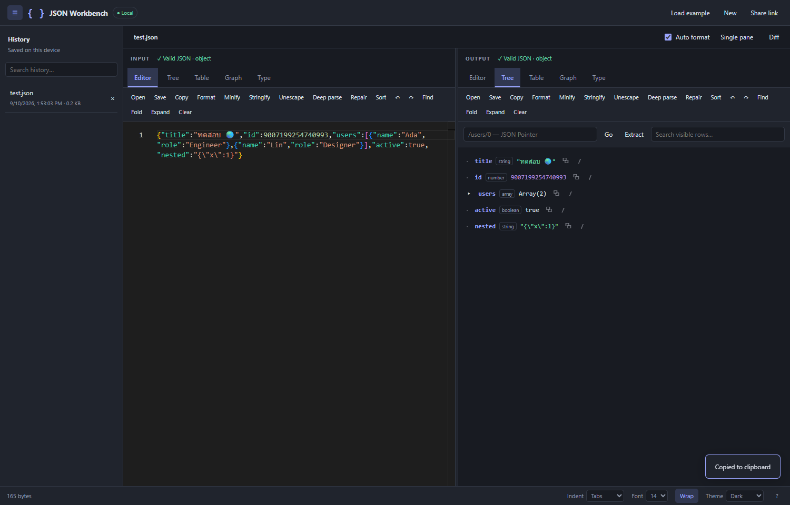
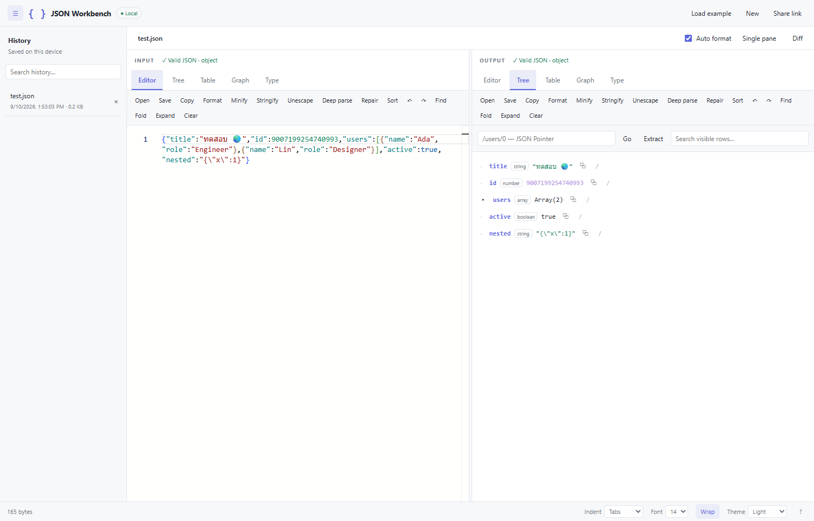

# JSON Workbench

A local JSON workspace for Visual Studio Code: two editable Monaco panes, live validation, and Editor, Tree, Table, Graph, and Type views.

Inspired by [json.site](https://json.site/). This is an independent open-source project, not an official json.site extension or a pixel-identical copy.

[คู่มือภาษาไทย](README.th.md) · [Contributing](CONTRIBUTING.md) · [Changelog](CHANGELOG.md)



## Getting started

Install a `.vsix` with **Extensions: Install from VSIX…**, then run **JSON Workbench: Open** from the Command Palette.

Right-click in an editor and choose **JSON Workbench: Open Selection or Document** to load selected text, or the whole document when there is no selection. The command is also available for `.json` files in Explorer.

Requires VS Code 1.96 or newer. All runtime assets are bundled: no internet connection is required to edit JSON.

## Features

- Split editors, live validation with error locations, adjustable panes, and optional automatic formatting.
- Format, minify, stringify, unescape, deep parse, repair malformed JSON, and recursively sort keys. Large integers and decimal number tokens retain their exact values.
- Lazy Tree view with copy-value and copy-path actions; Table view with 100-row pagination; expandable Graph view.
- Type generation for TypeScript, JavaScript, Python, Go, Java, C#, Rust, Swift, Kotlin, Dart, C++, Ruby, and JSON Schema.
- JSON Pointer navigation and extraction, such as `/users/0/name`.
- Monaco find/replace, folding, undo/redo, and a side-by-side diff.
- Local history search/deletion and restoration of both editor drafts and preferences.
- File open/save, drag-and-drop, clipboard, and self-contained share links for other extension users.
- Light/dark/VS Code theme, font size, word wrap, and 1–4 spaces or tab indentation.



## Shortcuts

| Shortcut in an editor | Action |
| --- | --- |
| Ctrl/Cmd+Enter | Format |
| Ctrl/Cmd+S | Save to a file |
| Ctrl/Cmd+F | Find |
| Ctrl/Cmd+Z | Undo |

## Privacy and limits

JSON stays on the machine running the extension host. The extension sends no telemetry and does not call json.site or a remote processing service. With Remote SSH or WSL, VS Code may run the extension host remotely.

- Input limit: **100 MiB**. Parsing runs in Web Workers; tables and trees load incrementally. Performance depends on document structure and available memory.
- Type generation: samples up to **2 MiB**, with a **30-second timeout**. Review inferred types before using them as a contract.
- History: up to **50 snapshots / 200 MiB**, plus a separate draft. Changes are saved after about one second of inactivity; closing immediately or crashing can lose the latest edit.
- Share links contain compressed JSON directly. They are **not encrypted** and require the recipient to install this extension. Limits are **1 MiB** before compression and **12,000 encoded characters**. Export a file for larger documents.
- Tree/Table/Graph search covers loaded rows. Use Find in Editor to search the full document.
- Hosted json.site sharing, its account/community features, multilingual UI, and pixel-perfect parity are not included.

The parser's 100 MiB boundary and the browser UI are tested separately; not every view has been benchmarked with 100 MiB documents.

## Development

Use Node.js 22 or newer:

```sh
npm ci
npm run check
npm test
npm run build
npx playwright install chromium
npm run test:ui
npm run package
```

Open this repository in VS Code and press F5 to debug. See [CONTRIBUTING.md](CONTRIBUTING.md) for test configuration and [PUBLISHING.md](PUBLISHING.md) for release setup.

Source lives in `src/`, build scripts in `scripts/`, and tests in `test/`. CI runs type checks, logic tests, browser tests, and VSIX packaging. Build outputs, local history, test profiles, and credentials are excluded from source control.

## License

MIT. See [LICENSE](LICENSE). Bundled dependencies retain their licenses in [THIRD_PARTY_NOTICES.txt](THIRD_PARTY_NOTICES.txt).
